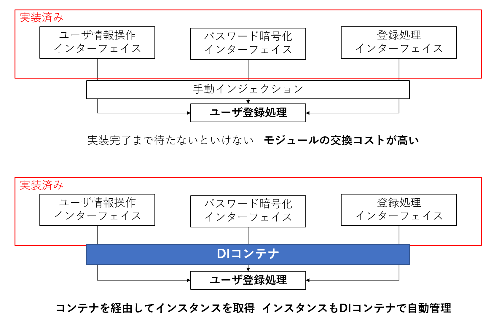

# DI(依存性の注入)

クラス実装には複数のコンポーネントを用いることが多い  
しかし、実装が終わる開発終盤までコンポーネントが揃わない  
ダミークラスを用いることもできるが、変更のコストが高いので、DI コンテナを用いて自動化することでインスタンスが自動で組み立てられる  
ただ、どれを用いて組み立てるかは DI コンテナにはわからないので、アノテーションで指定する



- 得られるメリット
  - インスタンスのスコープ制御が可能
  - インスタンスのライフサイクル管理
  - 共通機能の組み込み
  - コンポーネント間が疎結合となり、単体テストがやりやすい

### Tips DI と DI コンテナ

DI とはオブジェクトの注入と考えるとわかりやすい  
コンストラクタとかで DI（コンストラクタインジェクション）はできるが引数が多くなった際に実装が大変  
そこで、DI コンテナでインスタンスの構築を自動化

<br>

---

## Bean 定義

SpringFramework では`ApplicationContext`が DI コンテナの役割を持つ
SpringBoot では使われてない？？？  
`@Component`とかで自動化されているみたい

### 用語定義

- Bean：DI コンテナに登録するコンポーネント
  - Ban 定義：DI コンテナに登録する Configuration
  - ルックアップ：DI コンテナから Bean を取得すること

Bean の定義には、「Java ベース」、「XML ベース」、「アノテーションベース」がある  
アノテーションベースはコンポーネントスキャンという DI コンテナへの自動登録機能があり、便利

<br>

---

## Configuration 方法

アノテーションベースのみ扱う  
DI コンテナに管理させたい Bean を定義ファイルに定義するのではなく、Bean 定義用のアノテーションが付与されたクラスをスキャンして DI コンテナに登録  
⇛ コンポーネントスキャンと呼ぶ `@Component`

同様にインジェクションもアノテーションを付与して自動で DI コンテナに設定してもらう  
⇛ オートワイヤリングと呼ぶ `@Autowired`  
デフォルトで対象の形が一致する Bean を DI コンテナから探し、あればインジェクションする

```Java
import org. springframework.co ntext. annotation. ComponentScan;

// その他のimportは省略
@Configuration
@ComponentScan ("com.example.demo")
public class AppConfig {
｝
```

この例の場合、com.example.demo パッケージ配下のクラスをスキャンして、対象のアノテーションが付与されたクラスを DI コンテナに登録する。  
この属性を省略した場合は、コンフィギュレーションクラスと同じパッケージ配下をスキャンする

<br>

## インジェクションの種類

セッターインジェクションとフィールドインジェクションが存在  
フィールドインジェクションのほうが、コード量が少ない  
フィールドインジェクションではインジェクションしたいフィールドに`@Autowired`をつけるだけで、コンストラクタやセッターは省略可能  
省略した場合は Spring の DI コンテナを使用することになる

```java
@Component
public class UserServiceimpl implements UserService {
  @Autowired
  UserRepository userRepository;
  @Autowired
  PasswordEncoder passwordEncoder;
}
```
